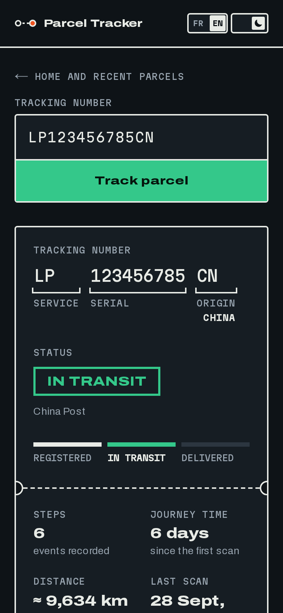

<div align="center">

# Parcel Tracker

**Where's your parcel? Paste the number, see the route.**

Parcel tracking for **any carrier, without an account**: the carrier is detected automatically by **17TRACK**, every scan is placed on a **Mapbox** map, and the journey is summed up like a shipping label.

### [→ Try it now](https://noam-s-parcel-tracker.netlify.app)

https://github.com/user-attachments/assets/b1482703-ffea-4d9c-bf2f-c21f901ec173

<br>


</div>

---

## Why

A parcel from abroad changes hands three or four times, and every carrier has its own tracking page: a list of cryptic scans (`CNSZXA`, `INTERNATIONAL MAIL CENTRE`, `FR - POINT SAV`…) with no sense of where the parcel actually is. Parcel Tracker takes any tracking number, finds the carrier on its own, merges the events of every carrier involved, and turns them into a route on a map with the figures that matter: how far, how long, and when it should arrive.

## Features

- **Any carrier, no account**: 17TRACK detects the carrier from the number. Formats it cannot detect on its own (Chronopost Shop2Shop numbers ending in `TS`) are hinted explicitly.
- **Route on a map**: each scan is geocoded from the carrier's text (UN/LOCODE codes, Chinese postal codes, cleaned-up place names), the route so far is drawn dashed and the remaining leg runs straight to the destination.
- **Key figures**: steps, journey time, distance as the crow flies, last scan ("yesterday") and estimated arrival, from the carrier or approximated when it gives none.
- **History by day**: click a step to see it on the map, click a marker to find it in the list. Long carrier messages are collapsed.
- **Tracking number anatomy**: international postal numbers (UPU S10 standard) are split into service, serial and country of origin.
- **New numbers too**: a number 17TRACK has never seen is registered on the fly, and the page keeps checking for about a minute while the first scans arrive.
- **Shareable links**: every parcel has its own URL (`?n=…`), and the browser's back and forward buttons move between parcels.
- **Recent parcels**, kept only in the browser (no account, no database).
- **French and English**, **light and dark** themes, and every animation is disabled when the user prefers reduced motion.
- **Accessible**: keyboard focus follows the search, results are announced to screen readers, and small controls get enlarged touch targets.

<p align="center"></p>

## Tech stack

| Layer | Choice |
|---|---|
| Framework | Next.js 16 (App Router, Route Handlers) · React 19 |
| Language & styling | TypeScript · Tailwind CSS 4 |
| Tracking data | [17TRACK API](https://api.17track.net) v2.2 |
| Maps | Mapbox GL JS 3 · Static Images API · Geocoding API |
| Hosting | Netlify (Next.js adapter, CDN cache for API responses) |
| Storage | None: recent parcels live in the browser's `localStorage` |

## Getting started

Requirements: Node.js ≥ 20.9, a [17TRACK API key](https://api.17track.net) (the free plan includes 200 tracking numbers) and a [Mapbox access token](https://account.mapbox.com/access-tokens/).

```bash
npm install
cp .env.example .env.local   # then fill in the variables (see below)
npm run dev                  # http://localhost:3000
```

Production build: `npm run build && npm start`. Checks: `npm run lint` and `npm run typecheck`.

If your Mapbox token is restricted to some URLs, add `http://localhost:3000` to them: the port is part of the check.

### Environment variables

| Variable | Required | Description |
|---|---|---|
| `TRACK17_API_KEY` | yes | 17TRACK API key. Server-side only. |
| `NEXT_PUBLIC_MAPBOX_TOKEN` | yes | Public Mapbox token for the map in the browser. Restrict it to your site's URLs in the Mapbox dashboard. |
| `MAPBOX_GEOCODING_TOKEN` | no | Mapbox token used for geocoding on the server, **without** URL restrictions (the server sends no `Referer`). Falls back to `NEXT_PUBLIC_MAPBOX_TOKEN`. |
| `TRACK17_DAILY_REGISTER_LIMIT` | no | New numbers registered per day, all visitors combined (default `5`, `0` disables registration). |
| `TRACK17_QUOTA_RESERVE` | no | 17TRACK quota units kept in reserve: below this, no new number is registered (default `20`). |

### Deploying (Netlify)

1. On netlify.com, import the GitHub repository. `netlify.toml` sets the build command and the Next.js adapter.
2. Add the environment variables above.
3. In the Mapbox dashboard, restrict `NEXT_PUBLIC_MAPBOX_TOKEN` to the site's URL, and create a separate unrestricted token for `MAPBOX_GEOCODING_TOKEN`.
4. In the 17TRACK dashboard, set a daily tracking limit: it is the only limit 17TRACK enforces itself, whatever happens on the site.

To save build minutes, this project deploys from a dedicated `production` branch with branch deploys and deploy previews turned off: pushing to `main` builds nothing, and `git push origin main:production` ships.

## How it works

### Tracking a parcel

1. **Search**: the number is normalised (spaces removed, upper case) and checked in the browser (5 to 50 letters or digits, at least one digit), then the URL becomes `?n=NUMBER`.
2. **Request**: `GET /api/track/{number}`. The number is in the path so that the Netlify CDN can cache a ready response for 3 minutes: looking at the same parcel again wakes up neither the function, nor 17TRACK, nor Mapbox.
3. **Known number**: `gettrackinfo` (free) returns the events, which are turned into the page's data (see below).
4. **Unknown number**: after the quota checks, the number is registered with `register` (1 quota unit) and the API answers `202 Pending`. The browser asks again after 4, 4, 6, 8, 10, 12 and 16 s: one minute, 8 requests.
5. **Display**: the result gets the keyboard focus and is announced, the tab title becomes `LP123456785CN · In transit`, and the parcel is added to the recent parcels.

### From 17TRACK events to a map

- **Merging carriers**: a parcel often has several providers (origin post, airline, destination post). Their events are merged and sorted, and an event reported by two carriers at the same second is kept once, preferring the one with a city.
- **Place and message**: some carriers put "PLACE, message" in the location field and repeat everything in the description. The place is split off for a clean title.
- **Locating a scan**, in order of preference:
  1. coordinates given by the carrier;
  2. the city from the structured address;
  3. a country on its own (`FR`), shown as the country name;
  4. a UN/LOCODE code (`CNSZX` → Shenzhen) from a table of the most common ones;
  5. a Chinese postal code prefix;
  6. the raw text, stripped of generic words ("International Mail Centre", "Post Office") that make geocoders pick the wrong place, and searched first in the event's country, then in the parcel's countries, so that a short name like `MA-PO` is not placed in Mali.
- **Geocoding**: all lookups run in parallel on the server, with duplicates merged and an in-memory cache.
- **Estimated arrival**: the carrier's date when there is one, otherwise the first scan plus 12 days (international) or 5 days (domestic), labelled as approximate.
- **Language-neutral data**: the API never translates carrier text and never writes its own fallback text. The browser composes those in the current language, so switching language never needs a new request.

### The map

The map is the heaviest part of the page (mapbox-gl is about 450 KB and several seconds of CPU on a phone), so it is loaded in two steps:

1. **Static preview**: a background image from the Mapbox Static Images API, with the route and markers drawn on top in SVG, in the site's colours. It costs one image request.
2. **Interactive map**, loaded only when the user clicks the map, a marker or a history step. Its download starts as soon as the pointer enters the map.

Both use the same framing, computed in `lib/map-view.ts` (Web Mercator, 512 px tiles), so the interactive map opens exactly where the preview was, with no fly-in animation and no wasted tiles.

### Architecture

```
app/
├── layout.tsx                   Fonts, theme / language / deep-link scripts run before first paint
├── page.tsx                     Search, URL sync (?n=…), results
└── api/track/[number]/route.ts  GET: checks, rate limits, cache, 17TRACK orchestration
components/
├── MapPanel.tsx                 Static preview, legend, on-demand interactive map
├── TrackingMap.tsx              mapbox-gl map (markers, popups, theme switch)
├── ParcelHeader.tsx             Status, progress and key figures
├── TrackingTimeline.tsx         History grouped by day
└── …                            Form, recent parcels, banners, guide, toggles
lib/
├── track17.ts                   17TRACK client, event merging, statuses
├── quota.ts                     Quota guard before every registration
├── rate-limit.ts                Per-IP rate limiter
├── tracking.ts                  17TRACK data → page data
├── locations.ts                 Place resolution (UN/LOCODE, postal codes, cleaned names)
├── geocode.ts                   Parallel Mapbox geocoding with cache
├── map-view.ts                  Framing shared by the static preview and the interactive map
├── journey.ts                   S10 parsing, distance, duration, day grouping
├── dictionary.ts                Every text, in French and English
└── api.ts, use-parcel-search.ts Browser-side client, polling and search state
```

### Protecting the free 17TRACK quota

Looking up a number is free, but **registering** a new one costs one quota unit, and anyone can type a number. So `/api/track` guards registrations:

- **Daily budget**: before each registration, the remaining quota is read from 17TRACK (`getquota`, free). Registration is refused if today's count has reached the stricter of `TRACK17_DAILY_REGISTER_LIMIT` and the account's own daily limit, or if the quota is down to `TRACK17_QUOTA_RESERVE`. If the check fails, registration is refused (fail closed). The site then shows a neutral "daily limit reached" banner: numbers already tracked still work.
- **Per IP**: 30 requests per minute and 3 registrations per hour (in memory, per server instance).
- **No duplicates**: numbers are upper-cased, concurrent searches for the same number share one call, a number registered in the last hour is not registered again, and "already registered" counts as success.
- **No junk**: a number must contain a digit, and invalid numbers are rejected in the browser before any request.
- **No calls from other sites**: `/api/track` requires an `x-parcel-tracker` header that another origin cannot send without a CORS preflight (which the route does not answer), and checks `Sec-Fetch-Site`/`Origin`. A third-party page therefore cannot make its visitors register numbers, not even with an `` tag.

### Security

- **Keys stay on the server**: 17TRACK and geocoding calls only happen in the route handler. The only key in the browser is the public, URL-restricted Mapbox token.
- **Security headers** (`next.config.ts`): Content Security Policy compatible with Mapbox, `frame-ancestors 'none'`, HSTS, `nosniff`, a strict referrer policy and a restrictive permissions policy.
- **No leaks in errors**: 17TRACK's raw messages (which can describe the account) are logged, never returned. Every error has a code the browser turns into a message.
- **Only ready responses are cached**: pending responses and errors are `no-store`.
- **Carrier text is inserted as text**, never as HTML, including in map popups.

### Performance

Lighthouse, production site, result page:

| | Performance | Total blocking time | Layout shift | Page weight |
|---|---|---|---|---|
| Mobile | 96 | 70 ms | 0 | 347 KB |
| Desktop | 99 | 0 ms | 0 | 464 KB |

The home page scores 97 on mobile and 100 on desktop, and every page scores 100 for accessibility, best practices and SEO. Behind those numbers: the map loaded on demand, API responses cached by the CDN, and a small script that shows the search frame instead of the home page before the first paint of a `?n=` link, so the page never jumps.

### Error handling

| Case | Behaviour |
|---|---|
| Empty or impossible number | message under the field, no request sent |
| Carrier not recognised by 17TRACK | explicit message with the 17TRACK code |
| Daily registration limit reached | neutral "daily limit reached" banner, tracked numbers still work |
| No data yet after a minute | "not available yet, try again in a few minutes" |
| Too many searches from one connection | "please wait" message (HTTP 429 with `Retry-After`) |
| 17TRACK busy (429), unreachable or down | explicit message, nothing cached |
| No scan has a location | a short note instead of an empty map |

## Design

The vocabulary of a shipping label: label paper and thermal-printer ink, the green of the CN22 customs sticker, the orange of courier labels. Tokens live in `app/globals.css`.

- Typefaces: Archivo (its width axis, pushed wide, for headings) and Martian Mono for data: numbers, times, labels.
- Signature elements: cards shaped like labels with a perforation line and its notches, brackets under the parts of an S10 number, the status printed as a stamp, and a dotted line that "travels" while searching.
- The map follows the theme, and the route uses the site's own colours in both the preview and the interactive map.

## Credits

Tracking data by [17TRACK](https://www.17track.net). Maps © [Mapbox](https://www.mapbox.com/about/maps/) © [OpenStreetMap](https://www.openstreetmap.org/copyright). Not affiliated with 17TRACK, Mapbox or any carrier. The parcel in the screenshots is fictitious.

## License

[MIT](LICENSE) © 2026 Noam Bouriche
